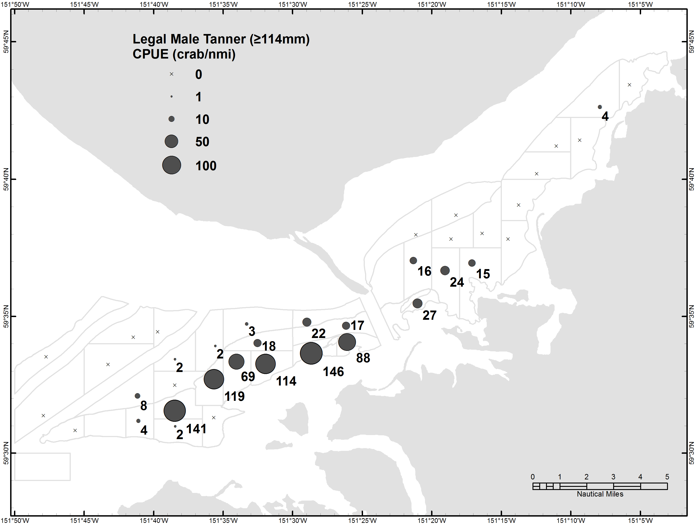

```{r, echo=FALSE, message=FALSE, warning=F}
library(knitr)
library(xtable)
library(tidyverse)
library(kableExtra)
options(scipen=9999) # remove scientific notation
knitr::opts_chunk$set(echo = FALSE, message=F, warning=F)
```

The 2019 Southern District large-mesh bottom trawl survey was completed between May 22nd and 26th.  A total of 38 successful 0.5 nmi tows were completed, all in core stations.  No ancillary stations were sampled this year.  A total of 1,682 male and 2,661 female Tanner crab were captured.

The recruit class size definitions for male Tanner crab in Cook Inlet were revised in 2017, coinciding with a reduction in the legal size limit from 140 mm (5.5 in) to 114 mm (4.5 in) (Table 1). For historical comparison the entire time series of survey data (1990 to 2019) is summarized using both sets of recruit classes herein.

Using the new legal size (114 mm), 420 legal males were captured in the 2019 survey.  Mean legal male CPUE was 22.2 crab/nmi (CV = 190%) and ranged from 0 to 146.  The estimated abundance of legal males using the new legal size was 273,511 crab (+/- 170,281 @ 95% CI), a 23% increase from 2018. While the legal male abundance has increased in 2 consecutive years since 2017, it remains less than what was observed prior to 2010 (Table 2; Figure 2).

Using the old legal size (140 mm), 6 legal males were captured in the 2019 survey.  When analyzed using the old size categories, the 2019 survey produced the lowest legal male abundance estimate on record, 4,135 crab (+/- 5,149) (Table 3; Figure 3).      

Legal male Tanners were found predominately in deep water west of the spit (Figures 4 and 5). 
   

\newpage
\listoftables
\listoffigures


\hfill\break
\hfill\break
\hfill\break

```{r, results='asis', echo=F}
read.csv("../data/ClassLUT_T04931_2017.csv") %>%
 select('Recruit category' = Recruit.category, 'pre-2017'= pre.2017, 'post-2017' = X2017) -> LUT
  print(xtable(LUT, caption = 'Male Tanner crab recruit class size definitions (carapace width in millimeters) used in the Southern District trawl surveys.'),
        comment=FALSE, include.rownames = FALSE , caption.placement = "top")
```  


\newpage
```{r, results='asis', echo=F}
read.csv("../output/931PopMales_Main_17.csv") %>%
    select(Year = Year, Tows, 'Pre-4 (<66)' = Pre4, 'Pre-3 (66-79)' = Pre3,
           'Pre-2 (80-95)' = Pre2, 'Pre-1 (96-113)' = Pre1,
           'Abund. (>114)'= LM, '95% CI'= LM_CI, 'Abund.' = TM, '95% CI '= TM_CI ) %>%
    mutate (Year = as.factor(Year)) %>%
    mutate_if(is.numeric,funs(prettyNum(., big.mark=","))) %>%
    mutate (Year = as.numeric(as.character(Year))) %>%
    add_row(Year = c(2010,2014:2016), 'Pre-1 (96-113)' = rep('No_Survey',4)) %>%
    mutate_all(funs(replace(., is.na(.), '-'))) %>%
    arrange(Year) -> LM17

kable(LM17, format = "latex", booktabs = T, align = 'r',
      caption="Male Tanner crab abundance estimates using the 2017 size class definitions from trawl surveys in the Southern District, 1990-2019. Parenthetical size limits are carapace width in millimeters.") %>%
kable_styling() %>%
add_header_above(c(" " = 2, "Pre-Recruits" = 4, "Legal Males" = 2, "Total Males" = 2))%>%
column_spec(1:2, width = "1.3em") %>%
column_spec(3:6, width = "3.9em")%>%
column_spec(7, width = "4.5em") %>%
column_spec(8, width = "3.9em") %>%
column_spec(9, width = "4.6em") %>%
column_spec(10, width = "3.9em")

read.csv("../output/931PopMales_Main_old.csv") %>%
    select(Year = Year, Tows, 'Pre-4 (<70)' = Pre4, 'Pre-3 (70-91)' = Pre3,
           'Pre-2 (92-114)' = Pre2, 'Pre-1     (115-139)' = Pre1,
           'Abund. (>140)'= LM, '95% CI'= LM_CI, 'Abund.' = TM, '95% CI '= TM_CI ) %>%
    mutate (Year = as.factor(Year)) %>%
    mutate_if(is.numeric,funs(prettyNum(., big.mark=","))) %>%
    mutate (Year = as.numeric(as.character(Year))) %>%
    add_row(Year = c(2010,2014:2016), 'Pre-1     (115-139)' = rep('No_Survey',4)) %>%
    mutate_all(funs(replace(., is.na(.), '-'))) %>%
    arrange(Year) -> LM17

kable(LM17, format = "latex", booktabs = T, align = 'r',
      caption="Male Tanner crab abundance estimates using the pre-2017 size class definitions from trawl surveys in the Southern District, 1990-2019. Parenthetical size limits are carapace width in millimeters.") %>%
kable_styling() %>%
add_header_above(c(" " = 2, "Pre-Recruits" = 4, "Legal Males" = 2, "Total Males" = 2))%>%
column_spec(1:2, width = "1.3em") %>%
column_spec(3:5, width = "3.9em")%>%
column_spec(6, width = "4em") %>%
column_spec(7, width = "4.5em") %>%
column_spec(8, width = "3.9em") %>%
column_spec(9, width = "4.6em") %>%
column_spec(10, width = "3.9em")
```  

```{r, results='asis', echo=F}
read.csv("../output/931PopFems_Main.csv") %>%
  select(Year = year, Tows = tows, 'Juvenile' = FT11_P_, '95% CI' = FT11_P_CI_,
         'Abund.' = MF_P_, '95% CI ' = MF_P_CI_, 
         'Abund. ' =TF_P_, '95% CI  ' = TF_P_CI_) %>%
         
  mutate (Year = as.factor(Year)) %>%
  mutate_if(is.numeric,funs(prettyNum(., big.mark=","))) %>%
  mutate (Year = as.numeric(as.character(Year))) %>%
  add_row(Year = c(2010,2014:2016), 'Abund.' = rep('No Survey',4)) %>%
  mutate_all(funs(replace(., is.na(.), '-'))) %>%
  arrange(Year) -> fem

kable(fem, format = "latex", booktabs = T, align = 'r',
      caption="Female Tanner crab abundance estimates from trawl surveys in the Southern District, 1990-2019.") %>%
  kable_styling() %>%
  add_header_above(c(" " = 2, "Juvenile" = 2, "Mature" = 2, "Total Females" = 2))
```

\pagebreak
\newpage


```{r, results='asis', echo=F}
read.csv("../output/2019T04_931CatchByStation_17sc.csv", colClasses=rep("character"),11) %>% 
  select(Station, nmi,  'Pre-4' = Pre4, 'Pre-3' = Pre3, 'Pre-2' = Pre2, 'Pre-1' = Pre1, Recruit, 'Post-Rec.' = Post,
    'Total' = TotMales, 'Juvenile' = JuvFems, 'Mature' = MatFems,
    'Total ' = TotFems) %>%
kable( format = "latex", booktabs = T, align = 'r',
    caption="Number of Tanner crab caught in the 2019 Southern District trawl survey categorized using the 2017 size classes.") %>%
kable_styling() %>%
add_header_above(c(" " = 2, "Sublegal" = 4, "Legal" = 2)) %>%
add_header_above(c(" " = 2, "Males" = 7, "Females" = 3))
```

\pagebreak
\newpage




